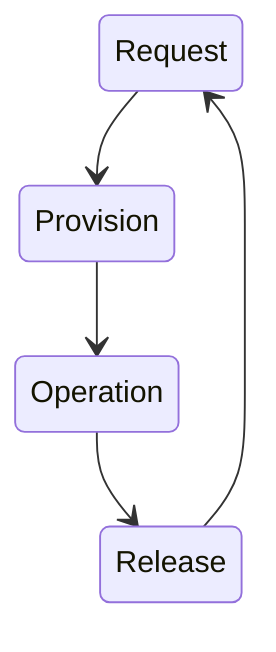
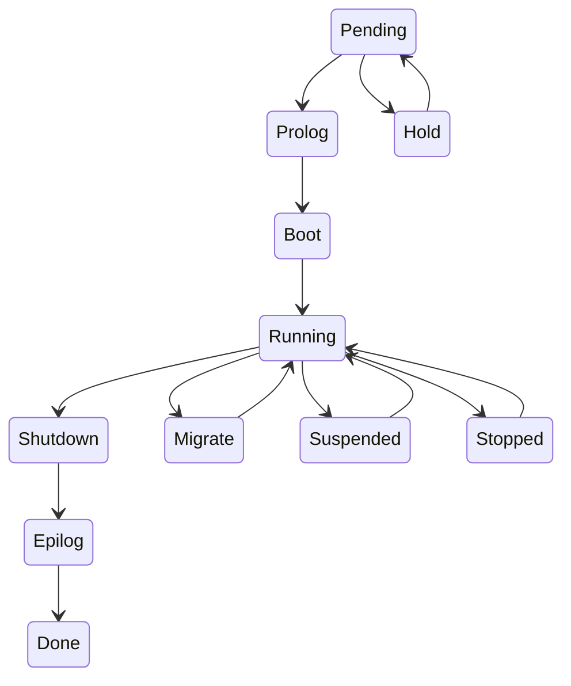

# Topic 1: Virtual Infrastructure Management

* What are the tasks of VIM?
* Describe the structure of a typical VIM solution
* What is the life-cycle of a VM and how do you migrate a VM?
* How do you control placement and scheduling of VMs? (not: SLA-driven management)

Material: slides on VIM and VIM migration, CC book chapter 1, 5 and 6, not section 6.4.

## Tasks
Virtual Infrastructure Management has the same overall goals as a single-computer operating system, but tries to satisfy them for distributed stacks.

* **Provide Uniform View to Virtualized Resources**
* **Provide VM Management**
* **Provide Resource Allocation, Scheduling, Balancing**
* **Provide Monitoring, Fault-Tolerance, Maintenance Support**
* **Provide Interfaces/APIs**

## Structure of VIM Solution
Typically a master-slave architecture, where a node can be physical or virtual.
Manages users, storage, networks, interfaces, etc.

## Life-cycle of a VM and migrating a VM

### Manual Lifecycle
For the manual lifecycle, someone would have to go through these step for each request received for provisioning.

### Automatic Lifecycle
The automatic lifecycle allows self-service style businesses to supply virtual machines on demand, which leads to a slightly more complex lifecycle, but much faster service.

### Migrating a VM
There are three main methods for VM migration:
* **Live Migration**: The migration of a running VM. This ensures high availability and a disruption for only a few milliseconds.
* **Regular or Cold Migration**: The migration of a powered-off VM.
* **Live Storage Migration of VM**: Moving the configuration file or virtual disks of a VM without disrupting its services.

**Live Migration** is the most interesting of these, as it isn't trivial to implement, but has the most positive outcome, i.e. no visible down-time for the users.

## Controlling Placement and Scheduling
A VI manager typically has configuration options for this. OpenNebula, for example, assumes that there is a base image repository which holds the images to use, and allows different ways to access it, such as HTTP, FTP, or even the NFS.

Scheduling is different depending on the assumptions of the provider.
Big providers such as Amazon can use the immediate provisioning model, since they can assume they have infinite resources.
Private clouds can configure scheduling via e.g. Haizea, which uses a lease-based resource provisioning model. Alternatives are best-effort, or pre-reservations.

TL;DR: The scheduler is typically separate from the VI manager, and can be configured to use some specified model for scheduling images. (Haizea allows this configuration to be written in Python!)