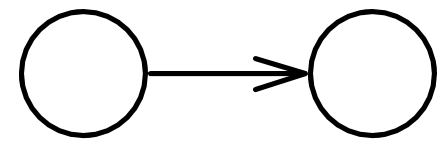
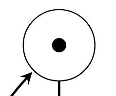
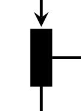
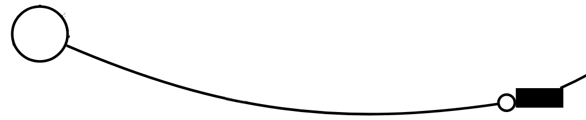

# Verification
_Verification_ is the process of ensuring that a model conforms to a specification.

## Model Checking

_Model Checking_ is the automated process of verifying that a given property holds for a given model.

### Modelling Language
Definitions of the _Networks of Timed Automata_ modelling language.

**Notation**:
- _Location_: a place in a single template or process
- _State_: the state of the complete system including clock valuations and variable values
- _Edge_: a step between two locations
- _Transition_: a change of the global state of the system

There are four kinds of locations in UPPAAL.
From left to right, these are: _Normal_, _Initial_, _Urgent_, and _Committed_.


An edge is always between two locations.
The two locations can be the same location, i.e. from itself to itself.



- _Invariant_: Something that must be true in a given location.
    - If it is not true, we must leave, or else we deadlock.
    - If it is not true, we cannot enter the state.
- _Guard_: A condition that must be true in order for an edge to be enabled.
- _Synchronization_: The label on which the edge synchronizes with another edge.
    - If nothing is present, we call it a :tau: transition.
- _Broadcast channels_: A method of synchronization.
    - One broadcaster at a time.
    - Multiple receivers.
    - All that can participate must participate.
- _Urgent channels_: A method of synchronization.
    - Does not allow clock guards on its edges.
    - Must synchronize as soon as possible.
- _Initial location_: The location in which a given process starts.
- _Committed location_: A committed location is a location which requires that if it is a part of the current state, the next transition must involve at least one committed location.
- _Urgent location_: An urgent location requires that time cannot pass while it is a part of the current state.

### Specification Language

- _E <> P_: For at least one path, there exists a location in which P holds.
- _A <> P_: For all paths, there exists a location in which P holds.
- _E [] P_: For at least one path, the invariant P holds for the entire path.
- _A [] P_: For all paths, the invariant P holds for the entire path.
- _P --> Q_: For all paths, if P then Q
- _P --> <=t Q_: For all paths, if P then Q within timeframe.

## Scalability & Model Checking: UPPAAL 2

## TAPAAL and Timed Arc Petri Nets
TAPAAL is a program for building Timed-Arc Petri Nets and model checking them.

### Petri Nets
A Petri net is a tuple N = (P, T, A, W)
- _P_: A finite set of places
- _T_: A finite set of transactions.
- _A_: A finite set of arcs.
- _W_: The weight function, taking an arc and returning a natural number.

A _place_ in a Petri Net is drawn as a circle.
_Arcs_ are drawn from the circle to _transitions_, and the other way around.
_Tokens_ are represented as filled circles inside a place.



_Transitions_ are drawn as filled black boxes.



The initial state of a Petri Net is expressed as a _marked net N_, which is a pair _(N, M0)_.

#### Inhibitor Arcs
The _inhibitor arc_ goes from a _place_ to a _transition_, and enforces the condition that the _transition_ may only fire if the _place_ is empty.



### Timed-Arc Petri Nets
Timed-Arc Petri Nets are an extension of Petri Nets, where:
- Tokens have an age
- Tokens grow older at the same rate
- Input arcs to transitions have a time interval

#### Age Invariants
An age invariant is a condition for a place.
The token age must correspond with the age invariant, or it deadlocks.

#### Transport Arcs
A transport arc conserves the age of the token while transferring it from one place to another.

## Static Analysis

## Bounded Model Checking
Bounded Model Checking covers _SAT_ and _SMT_ solvers.
They are both types of constraint satisfaction problems.

### SAT
_SAT_ is short for _SATISFIABILITY_, which again is a term for _Boolean Satisfiability Problem_.
Problems are posed as boolean logical formulas in _conjuctive normal form_, or CNF.

### SMT
_Satisfiability Modulo Theory_ is an extension of _SAT_, where groups of variables can be replaced by predicates.
This essentially allows _SMT_ solvers to use _SAT_ solvers to solve subproblems.

### Amazon
> Engineers use TLA+ to prevent serious but subtle bugs from reaching production

The engineers use two languages for verification:
- _TLA+_: The mathematical modelling language which can be used to verify properties of a model.
- _PlusCal_: A programming language which can be transpiled to TLA+.
    Is not as expressive as TLA+, but can be more friendly for beginners.

Typical process:
1. Implement happy path
2. Implement error handling for common errors

TLA+ process:
1. Define system properties
2. Write TLA+/PlusCal code
3. Verify properties

"What needs to go right" vs. "what could go wrong".

This approach also allows engineers to test new optimizations on the model before releasing them into production.
The model becomes a testing ground for "what-if" features.

They complain that they do not know of a formal method for preventing _sustained emergent performance degradation_, where cascading events cause the server to become effectively unavailable.

Key benefits of formal methods:
- _Get the design right_: Formal tools can verify high-level designs.
- _Gain better understanding_: Formal tools help engineers understand the design in a more intuitive fashion.
- _Write better code_: Formal tools teach engineers to write self-diagnosing code.

### Facebook
> integrating a verification tool based on static analysis into the software development cycle

The Facebook engineers brought a formal static analyzer tool, [Infer](https://fbinfer.com/) from Monoidics, which applies separation logics on program artifacts.

For example, it's possible to detect resource leaks, etc via the following command:
```
$ infer -- javac Program.java
```

The focus of the Facebook engineers is to provide fully automatic feedback on certain soundness bugs, such as memory safety and data races.
As opposed to Amazon, this approach does not require engineers to be trained in formal methods, simply that they respond to the feedback of the tool.
The tool works by inferring specification from the code, and ensuring that the program conforms with the inferred specification.

It does not require whole-program analysis, which allows it to return results typically within 10 minutes.

## Quantitative Model Checking
_State Space Explosion_: When states can be combined, these combinations expand exponentially, which makes it very difficult to cover all possible variations of a program, or its abstraction.

Statistical Model Checking combats this problem by calculating the statistical probability of a property holding in a given model.
