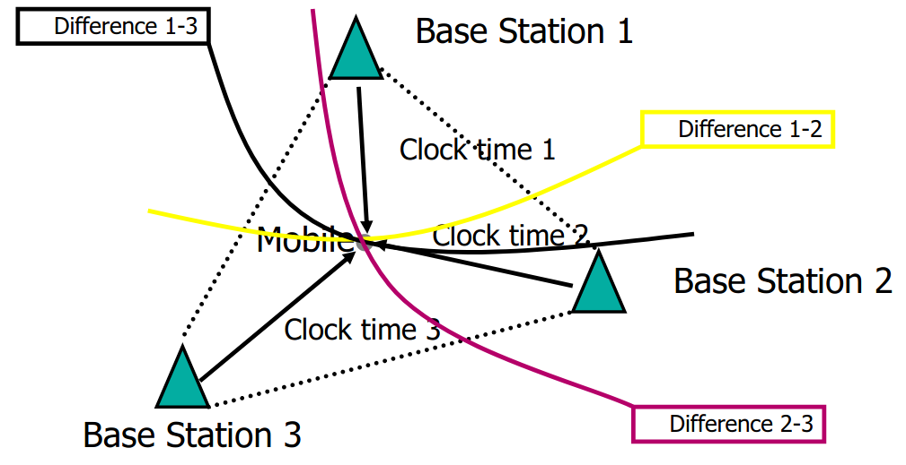

## Location Based Services (LBS)

### LBS in General
- what is LBS
  - Infers location of entities (1 or more)
  - Communicate between devices
  - Uses location data.
    - examples of applications that provide information services
      - Input: Location data, service requests
      - P2P interaction
      - Output Location relevant info
    
LBS triangle:
- Geoinforation -> contents
- locaiton -> location-dependend contents/service
- communication -> service delivery

Four universal roles 
- Terminal
  - A mobile terminal provides the ability to change location.
- Location enabler
  - a system enables the inferrence of the location of mobile terminals
- Service provider
  - a service provider can generate additional value by utilizing location information
- Service user
  - a user can utilize the service

Components in LBSs
- Localization, done 
  - outdoor with GPS, Cellular, WiFi
  - Indoor, wifi, bluetooth, RFID
- Service component:
  - Requests parsing
  - location-dependent query processing
  - result delivery
- Information rendering:
  - Display to user
  - Coordination with service component

#### GPS-based LBS architecture
- Lbs server talks with Mobile client, which provides its GPS location. Several clients exist, providing different locations.
- Slide with categories.

#### Important issues in LBSs
- Positioning, location data management, location -dependent query processing, location privacy
  - Each of these have indoor/outdoor aspects.

#### Location technologies:
- Network based: Use the infrastructures (antennas, base station), device is either sends signal, or is sensed by network
- Terminal based: location is stored within terminal, location is calculated by the user device, from signals from base stations, GPS.

##### Basic techniques for positioning
- Cell global identity (CGI), 
  - Cell of Origin (COO), Cell-id, location, signature, location beacons.
  - Masts are placed in a "grid" of cells, location of device can be determined based on the ID of the cell(s) that are currently covering the phone
- time of arrival(TOA)
  - UL-TOA (uplink time of arrival)
  - can determine distance based on speed and time difference between sending and recieving a tignal
  - indicate distance between multiple terminals = phone location 

- time difference of arrival(TDOA)
  - Measure the time difference between base stations. Terminals location is determined on a curve. More base station pairs, result in more curves, more accurate location.

#### Global Positioning System (GPS)
- Also uses principle of speed, time, distance (TOA, TDOA), however, base stations are now in space!
  - 68 launched satellites, base stations in space.
  - 95% uptime
    - With only 1 base station we cant know precise location
    - with 2 we can get a more accurate
    - With 3 we should be able to narrow down location even further - it gives 2 possible points.
    - with 4 we should be able to accurately locate locations. (Based on the overlap)

#### National Marine Electronics Association (NMEA) standards
- Standard for comms between marine electronics devices.
  - Transmission of GPS data from GPS receiver to other devices, for real time positioning.
  - Data sends a message, a series of data, in a sentence.

##### Message Format
- Sentences start with $12345,f1,df2
  - 1 and 2 specify the device being used to determine position.
  - Next 3 represent context of sentence
    - Most important ones:
      - GGA: Current fix data, 3d location and accuracy data)
      - RMC: Minimum GPS sentences information
      - GSA: Satellite status data
  - Finally, data fields split by commas.

#### Alternative to GPS
- Global navigation satellite system (GNSS)
  - GPS (US)
  - GLONASS (Russia)
  - Galileo (EU)
  - BeiDou (china)
- Automatic identification system (AIS)
  - Used for ships, combination of radar, satellites and comms.

### Positioning and tracking (Elaborate further on sampling)
- A positioning system emits (ID, position)
  - Generalized position (error bounded)
  - maintenance of positioning is based on sampling.
    - samples contain the time and a possible inaccurate position.
      - Outdoor, GPS is used, indoors Wi-Fi or bluetooth is used.
- A tracking system uses the information from the positioning system to approxmiate the trajectory of a mobile object
  - Offline, approximate the historical trajectory
  - Online, We maintain the current position, and predicts the trajectory.
  - Approximation depends on the sampling frequency and the tracking method

#### Trajectories
- Moving objects gives trajectories,
- Usually just a sample of periodic positions
- Trajectory is a sequence of locations
- Linear interpolation, easily done and accurate enough if the sampling frequency is sufficiently high

#### Three cases of tracking
- Off-line: Given a set of samples, determine the trajectory
- On-line: Constantly maintain the location
- Prediction: Infer future locations, based on previous positions and velocity.

##### Online location tracking
- Mobile clients, continously moving objects, velocity is likely to change, based on traffic or other factors. Uses positioning technology (GPS)
- Centralized server, maintains the location for clients.
- Clients send a location update.
- Applications of tracking: Traffic jam finding, alert ahead service, fleet management.

##### GPS-based Outdoor tracking
- Clients can send and recieve messages from both satelite and ground-based terminals, achieving a more accurate reading of location. 
  - Also reduces communication cost between moving client and server while maintaining accuracy.

###### Client side update policies
- Period update:
  - Based on a delta T
  - Every Delta T time units, report current location to server, only last reported location is used
    - Cons:
        - Small delta T: High comms cost
        - Large delta T: Inaccurate location
        - Accuracy depends on the max speed of the client (reporting speed or velocity speed?)
- Region-based update
  - Domain is decomposed into region, client reports current region
  - Server keeps last region. Update when moving to new region?
    - Notes:
      - Update frequency set by size of regions
        - Region-based guarantee: An object is within its region
        - Finer regions: More accurate, more expensive, and vice versa.
- Others:
  - Point based:
    - As long as client is within a circle, centered at a known spot, no updates are sent
  - Vector based:
    - As long as current position is close enough to the vector, no updates
  - Segment based:
    - Applicaple to road network based clients, no updates as long as client stays close to segment

### Map Matching
- Why: Low precision in reporting of location. Might be difficult to determine where on the road a device actually is.

- GPS reports may be low precision
  - Map Matching is to find roads corresponding to a gps trajectory

#### Online v offline
- Online map matching relates the reported GPS positions to the road network while positions are reported
  - Eg. navigation for driving
  - real-time map matching can only rely on so-far recorded points. 
  - compromises performance over accuracy
- Offline matching happens after the trajectory data is collected
  - Eg. Analysis of car's driving history
  - Can take all GPS positions into consideration, giving more accuracy at the cost of performance

##### Steps in offline map matching
- Data preprocessing
  - Identify and remove outliers.
  - E.g DBSCAN clustering of GPS positions
- Matching
  - Use an offline method
- Post Processing
  - Evaluate the results
    - We need to know ground truth for evaluation
      - Can measure the distance between the trajectory after map matching and the ground truth trajectory
      - Count the amount of errors the matched trajectory still have

#### Distance between trajectories

Different metrics:
- Trajectory similarity measurement
- Geometric based
- Semantic based
- Hybrid

#### Inputs to Map Matching
Basic Inputs
 - GPS trajectory (online or offline)
 - road network
Other information that can be used
 - Vehicle Speed
 - Properties of the road network
   - topology
   - speed limit
   - etc...

#### Map matching methods

Local/incremental methods
- for each point in a given trajectory, find the *local* match (point or road segment) from the road network 

Global methods
- Match *entire trajectory* with the road network

Statistical methods
- Use probability related tools sych as Bayesian classifier, Hidden Markov Model, Kalman filter, etc..

NOTE: all categories may opt to use basic and/or more inputs.

#### Naive Map Matching
Snap each reported point to its nearest road segment.
- Easy to implement, but not always accurate.
- A local method

#### Global Method
- Try to find a curve in the road network that is *as close as possible* to the given trajectory.
  - thr road network is modeled as a graph embedded in the plane with straight-line edges.
- There are different distance measures
  - Fréchet distance is often used. 
- Also known as *Geometric map matching*

#### Fréchet distance example
Like walking a dog on a leash. The "dog" has a max distance (length of leash) that it can freely change speeds within (cannot go backwards).
- Fréchet distance is the *minimal leash length* necessary to walk the curves from beginning to end

*Example (black line$=$person's path, blue line$=$dog's path, orange lines$=$distance (leash) at points):*

#### Probabilistic Map Matching
- Look at a large pool of historical GPS trajectories.
  - Find those ones with similar previous-positions, find ratios for which new point has highest probability to be accurate.

#### Time Based Map Matching
- Take time, distance and speed-limit into account. 
  - Consider if point is feasible within time-frame

NOTE: if both of the two previous methods could match, compare distance/time deltas, and decide which is most probable given the circumstance (eg too fast or too slow to reach point)
